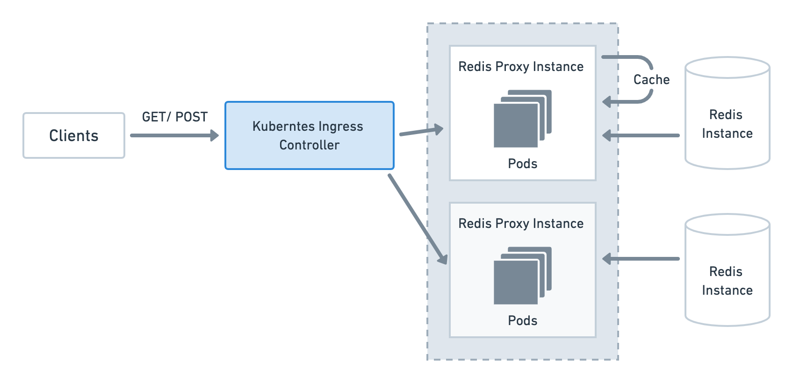

# Redis Proxy Instance
This service is a HTTP proxy server with caching for Redis

## Architecture overview



# What the code does
- Process GET request
- Process POST request (unstable) 
- Ready for deploy to kubernetes
- Caching used keys

# Algorithmic complexity of the cache operations
Key lookup is done through a key-entry mapping native object, which on most platforms mean O(1) complexity

# Instructions for how to run the proxy and tests

**Run tests on container**

```bash
make test
```

**Start Proxy instance as container**

```bash
make start
```

**Local development (already installed `yarn`)**
```bash
yarn dev
```
